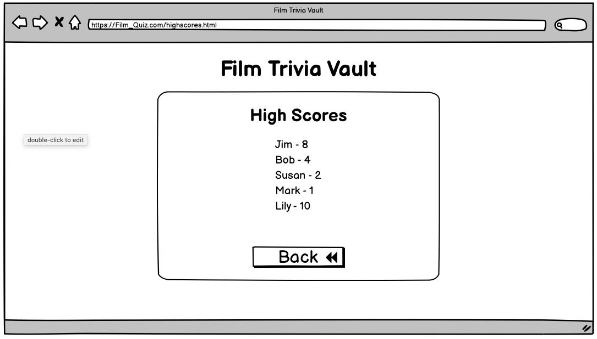

<h1 align="center"> :clapper: Film Trivia Vault :clapper: </h1>

[View the live project here](http://nickdevc.github.io/Film_Quiz/)

Film Trivia Vault is a website that allows users to experience a quiz based on film trivia. It provides a simple, yet rewarding experience by being both aesthetically pleasing and user-friendly. The website has been built with mobile users in mind, and intends to be fully responsive across all devices.

## Index - Table of Contents
*  [Purpose](#purpose)
*  [User Experience (UX)](#user-experience-ux)
*  [Features](#features)
*  [Design](#design)
*  [Technologies Used](#technologies-used)
*  [Testing](#testing)
*  [Deployment](#deployment)
*  [Credits](#credits)

## Purpose

The purpose of the website is two-fold:

### 1 - Existing users
To provide an easily acessible page to test thier film trivia knowledge, celebrate their successes and attempt to beat their previous score. 

### 2 - New players
To provide an engaging and appealing space to prospective users by making the landing page bold and user-friendly. New users will be able to clearly navigate the rules before engaging in the quiz itself. Replayability is actively encouraged.

## User Experience (UX)

-  ### User Stories
   
   -  #### 1) First Time Visitor Goals
      
      1. I want to easily understand and access the main purpose of the site
      2. I want to be able to easily learn about the rules of the game
      3. I want to be able to quickly and effectively navigate around the quiz, instinctively following the button structure on each page
      4. I want to be able to easily view my on-going progress
      5. I want to be able to quickly and efficiently share my score with others
      6. I want to be able to easily navigate back to the start to replay the game
   
   -  #### 2) Returning Visitor Goals
   
      1. I want to be able to access and navigate the menu quickly and efficiently
      2. I want to be able to easily check and compare my score with others
      3. I want to have the option of viewing the rules before I play
   
   -  #### 3) Frequent User Goals

      1. I want to be able to jump straight into the quiz without navigating unnecessary pages/links

## Features

   ### Existing Features
      
-   __Home page__

    - The landing page is designed to draw the user's eye immediately in, by placing all of the content centered in the viewport. The background colours (consistent throughout the website) are pastel, and non-intrusive meaning that the navigation buttons remain the main focus of the user.
    - The home page consists of: a title, a 'Start' button, a 'Rules' button, and a 'High Scores' button. All of these buttons are consistent in design and their functions are supported by icons to indicante their purpose.
    - All buttons have been given hover/transform effects to ensure that users get appropriate feedback when navigating through their options.

      

-   __Rules page__

    - A conscious decision was taken to make the 'Rules' page as simple as possible, so as not to detract attention away from the steps-to-play.
    - Rules have been presented in order to help with the flow of information to the user and their is one button to direct users back to the home page.

      
      
-   __Game page__

    - The quiz section of the website follows a uniform layout, to ensure that every question maintains the same aesthetic appeal and presents the user with a sense of growing familiarity as they progress.
    - The questions are presented in bold text, and the answer options are cleary labelled to ensure these are clearly demarcated from each other.
    - In addition, the user is provided with a running score and a progress bar to allow them to monitor their progress throughout the experience. This encourages healthy competition whilst also reassuring users of the end goal.
    - All option buttons have been styled with hover/transform effects and also highlight 'green' or 'red' (dependent on the validity of a user's answer) which provides further immediate feedback to the user.

      
      
-   __End page__

    - On completion of the final question in the quiz, the user is automatically taken to the final page where they are encouraged through text prompts to enter and share their score on the leaderboard.
    - User's can input their name and compare their score to other users, encouraging healthy competition and replayability.
    - By clicking 'Save', users are automatically transfered to the home page, once again subconsciously encouraging them to play through the game again in order to beat their previous score.

      

-   __High-scores page__

    - This page is automatically updated when user's input their final scores and presents a list (maximum of 5 strings of data) of user names and their corresponding scores.

      

   ### Potential Future Features
   
- A running timer
   - This could potentially add a level of challenge and compeition to the quiz, encouraging further replayability.
   - This could be further enhanced by reporting the 'finish time' to the user at the end of the quiz.
- A method of contacting the developer
   - This could allow users to report bugs but also allow for feedback on a product that has the potential to be regularly updated.
- A leaderboard that is hosted online
   - This would allow for a universal leaderboard where users could compare their scores from around the world

## Design

   ### Colour
- After carrying out research by looking at both existing Code Institute projects, and websites with a similar level of functionality and interactivity, I decided that unobtrusive colours would fit my user's needs. The theory was that by creating a calm, pastel colour scheme, users would be more inclined to relax and enjoy the game; focussing all their attention on the content and the interactivity.
- I used [Coolors](https://coolors.co/) to explore different colour schemes that best matched the above purpose and settled on [this](https://coolors.co/palette/006d77-83c5be-edf6f9-ffddd2-e29578) palette. I felt the emerald greens and the light browns provided a subtle contrast and that they would provide interesting feedback to the user when used in conjunction with transformations and 'on-click' functions.
- These colours were also used to create gradient effects that run throughout the website and help to create a sense of unique identity linked to the website.

   
   
   ### Typography
   
- [Google Fonts](https://fonts.google.com/) was used to source scripts that would be legible, evoke a sense of playfulness, and not detract from the user's ability to navigate the functionality of the website.
- 'Lobster Two' was chosen for all headings, subheadings, buttons and questions. The font is not only bold and eye-catching but, due to it's curving and flowing style, it also helps to evoke the 'playful' aspect that I hoped to promote to the user. In order to make this font even more impactful, I was able to apply a drop-shadow that was in-keeping with the overall colour palette.
- 'Raleway' was chosen for all remaining text elements. It is simplistic in design, easily legible, and also does not detract from the impact of the attention-grabbing headings.
  
   
   ### Initial Wireframe Plans
   
   #### Home Page Design
   
   
   
   #### Rules Page Design
   
   
   
   #### Game Page Design
   
   
   
    #### End Page Design
   
   
   
   #### High Scores Page Design
   
   

## Technologies Used

### Languages Used

-   [HTML5](https://en.wikipedia.org/wiki/HTML5)
-   [CSS3](https://en.wikipedia.org/wiki/Cascading_Style_Sheets)
-   [Javascript](https://en.wikipedia.org/wiki/Javascript)

### Frameworks, Libraries & Programs Used

-   [Google Fonts](https://fonts.google.com/)
      - Used to import specific fonts.
      - The fonts 'Lobster Two' and 'Raleway' were used throughout the project and were present on all pages.
-   [Font Awesome](https://fontawesome.com/)
      - Used to add icons for aesthetic and UX purposes.
      - The icons were applied to all usable buttons to clarify purpose.
-   [Git](https://git-scm.com/)
      - Used for version control by utilising the Gitpod terminal to commit to Git and Push to GitHub.
-   [GitHub](https://github.com/)
      - Used as the respository for the projects code after being pushed from Git.
-   [Balsamiq](https://balsamiq.com/)
      - Used to create wireframes during the initial design stages.
-   [W3C Markup Validation Service](https://validator.w3.org/)
      - Used to validate HTML.
-   [W3C CSS Validation Service](https://jigsaw.w3.org/css-validator/)
      - Used to validate CSS.
-   [JSHint](https://jshint.com/)
      - Used to validate Javascript.
-   [Microsoft Paint](https://apps.microsoft.com/store/detail/paint/9PCFS5B6T72H?hl=en-gb&gl=GB)
      - Used to edit screenshots for use in the README file.
-   [Coolors](https://coolors.co/)
      - Used to source a colour palette that would link to the club's brand identity.
-   [Techsini](https://techsini.com/multi-mockup/index.php)
      - Used to create mockup images of my live website on numerous devices and viewports.

## Testing

### Validator Testing
   
#### HTML
   
- Result from [W3C Markup Validation Service](https://validator.w3.org/):

   
   
   - Note: All html pages returned the same results as the above screenshot
   
#### CSS

- Result from [W3C CSS Validation Service](https://jigsaw.w3.org/css-validator/):

   
   
#### Javascript 

- Results from [JSHint](https://jshint.com/):

   
   
### Lighthouse Testing   

- Results for 'index.html'

   
   
- Results for 'rules.html'

   
   
- Results for 'game.html'

   
   
- Results for 'end.html'

   
   
- Results for 'highscores.html'

   
   
- Note: the 'performance' indicator on the index.html page would occassionally fluctuate between 90-100 score (seemingly at random). Regardless of this, I am confident that there are no hindering factors when it comes to the website and it's performance

### Browser Compatibility

- Testing has been successfully carried out on the following browsers:
   
   - Google Chrome - Version 100.0.4896.60 (Official Build) (64-bit)
   - Microsoft Edge - Version 100.0.1185.50 (Official build) (64-bit)
   - Mozilla FIrefox - Version 99.0.1 (64-bit)
   - Safari - Version 13.1.3 (15609.4.1)

### User Testing

- A total of **8 different users** tested the website across a range of devices including: mobile, tablet and desktop viewports. At the time of testing, the main conclusions drawn were as follows:
      
     - All navigational links worked as expected :white_check_mark:
     - Users were automatically pushed to the next question after answering :white_check_mark:
     - Questions and answers were not always fully visible on smaller devices :red_circle: 
          - This was later resolved using additional @media queries :white_check_mark:
     - When selecting answers, users were given visible feedback from answer buttons :white_check_mark:
     - The progress bar and score counter were not always visible to users on smaller devices :red_circle:
         - This was later resolved using additional @media queries :white_check_mark:
     - When users reached the end of the quiz, their total was not displayed and they were unable to select the 'save' button (it remained dsiabled) :red_circle:
         - This was a significant bug and was resolved during the debugging stages (see below) :white_check_mark:
     - Colours and font remained consistent across all user's devices. Everyone reported that the website was legible and easy to follow :white_check_mark:

### Resolved Bugs

- Initially, when users reached the end.html page, the 'disabled' feature of the 'save' button would not be removed when the user had successfully typed in thier name. I noticed that at the same time, the final score was not displaying correctly on the end.html page, and realised that these two issues were intrinsically linked.
   
   - Solution: By using [JSHint](https://jshint.com/) and seeking support on the Slack community, I was able to identify that this was the result of a syntax error within my definied variables. I renamed a variable and ensured that the naming convention was consistent with my other variables.

- When I deployed the website, buttons that were intended to send the user to other .html pages were not working and were returning a '404 error'.

   - Solution: By going through my code and identifying any instances of 'href' links, I was able to see that the shortcut of '/' to send users to the homepage was not working as intended. I changed this to the correct file path. In addition, within my JS, I could see that my 'assigned location' links were not working as intended, and so altered these to now display each page's full address.

### Unresolved Bugs

- Through testing on mobile devices only, I could see that the 'hover' styling remained applied to answers options from the user's previous interaction with a question. This does not prevent the user from playing the game, nor does it override the 'correct' and 'incorrect' styling feedback that the user is designed to see. In future, this is something I could look into changing in order to make the mobile experience match that of desktop.
 
## Deployment

   ### How to deploy

- Go to the GitHub repository and navigate to the 'Settings' tab. Once there, select 'Pages' from the menu
- Go to the 'Source' menu (drop-down box) and select 'Master Branch'
- After the page has auto-refreshed, you should see a detailed ribbon display - this demonstrates a successful deployment
- Now, any changes pushed from GitPod to the master branch will be visible and take effect on the live project [live project link](https://nickdevc.github.io/Film_Quiz)

   ### How to clone

- Go to the following repository on GitHub: https://github.com/NickdevC/Film_Quiz
- At the top right of the screen, click the 'Code' button, and then click 'HTTPs'
- Copy the link in this field
- In GitPod, open a new GitBash terminal and go to the directory where you want to find the clone
- On the command line type "git clone", then paste the copied url and press 'Enter'
- The clone process should now begin

## Credits

  ### Photos
  
-  Note: No photos/image were used in this project
  

  ### Code
  
-  'How to apply gradient backgrounds' - [W3Schools](https://www.w3schools.com/css/css3_gradients.asp)
-  Guidance on the use of single vs multi-line comments in JS - [Stack Overflow](https://stackoverflow.com/questions/19080730/why-the-distinction-between-single-line-and-multi-line-comments)
-  Guidance on the use of commits (based on feedback from my first project) - [Cbeams](https://cbea.ms/git-commit/)
-  Guidance on structuring my JS files and extra learning regarding JS functions - [Brian Design (Youtube tutorial)](https://www.youtube.com/watch?v=f4fB9Xg2JEY)
-  Further inspiration for layout and quiz functionality - [Web Dev Simplified (Youtube tutorial)](https://www.youtube.com/watch?v=riDzcEQbX6k)
-  Inspiration for writing my ReadMe file - [Daferia (Github user)](https://github.com/Daferia/ultimate_Quiz_P2)
-  My mentor Martina for specific support regarding: using JSHint, guidance with 'resetting' certain functions in JS, and highlighting 'good' examples of previous projects.

### Acknowledgements

- I want to say a special 'thank you' to my mentor, Martina, who has not only supported with specific code-related queries, but has also given me realistic perspective that has helped me to maintain focus and motivation during the project.
